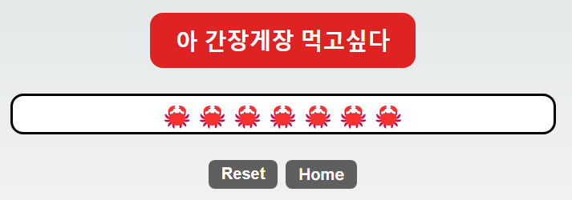

# Prac 02. React & CSS 기초

이번 주차는 현재 Branch를 기점으로 본인의 branch를 생성하여 진행합니다.

## Mission - 아래 화면 출력하기(사진 클릭 시 동작 영상 나옴)
[](/images/Study-01.mp4)
1. 문장이 담긴 버튼을 누르면 아래 게이지가 이모티콘으로 채워짐
2. reset 버튼: 게이지 초기화
3. home 버튼: 메인페이지 `...:3000/`로 돌아가기
- `http://localhost:3000/본인이름`에 구현하기. 템플릿이 구현되어 있음!
- 꼭 repository를 clone 해서 branch 생성 후 진행하기!!
- 완성된 app은 Pull request를 올려주시면 됩니다. 모르면 스터디오기🥳
- CSS 똑같이 할 필요는 없지만 비슷하게 구현하기! `module.css`활용

## Hint
### 0. `package.json`파일에 현재 app이 필요한 라이브러리가 전부 기록되어있으므로 `npm i` 또는 `npm install`을 입력하여 라이브러리를 설치해주면 됩니다.
### 1. `useState`: React의 변수 상태 관리 도구
### 2. `module.css`: 각 react 파일 element의 classname이 서로 겹쳐도 css가 겹치지 않도록 도와주는 CSS 도구
### 3. `'use client'`: Next.js의 클라이언트 렌더링 선언.
### 4. `onClick`: element가 클릭되었을 때 실행될 함수
### 5. react 문법 활용
``` ts
<div className={styles.progressBar}>
    {'🦀'.repeat(progress)} // 중괄호 안에 js, ts 문법 적용 가능!!
</div>
```
