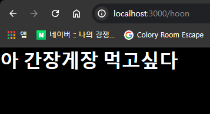
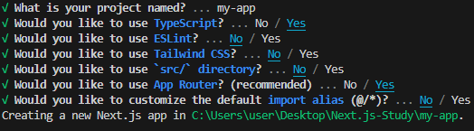

# Prac 01. NextJS로 페이지 라우팅하기

## Mission - 아래 화면 출력하기
- `http://localhost:3000/본인이름`에 하고싶은 말 띄우기  

## Hint

### 1. Node.js 설치 (https://nodejs.org/en) - v18 이상 짝수 버전 권장

### 2. VS Code 설치 (https://code.visualstudio.com/) - Mac 유저는 편한걸로!

### 3. `npx create-next-app`

### 4. `app/폴더명/page.tsx` 파일에 접속하려면 `http://localhost:3000/폴더명`에 접속하면 된다!

### 5. `npm run dev`